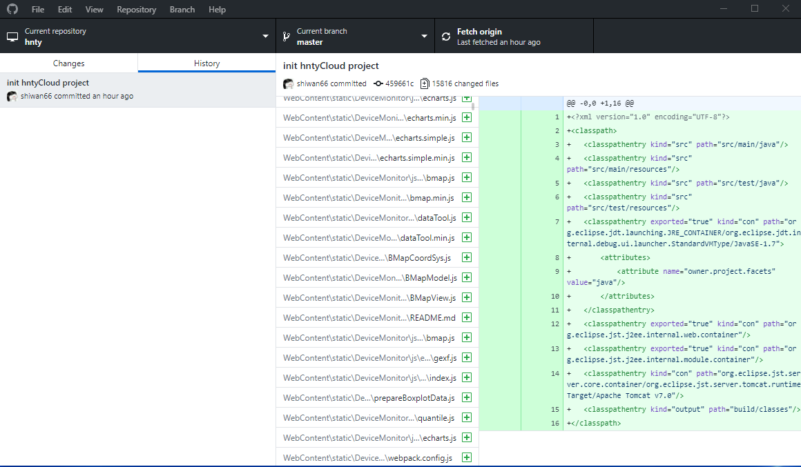

## git工具
1. 命令行工具 
`git` [**点击下载**](http://dlsw.baidu.com/sw-search-sp/soft/e7/40642/Git-2.7.2-64-bit_setup.1457942968.exe)  
  
2. github公司出品图形化工具 `GitHub DeskTop` [**点击下载**](https://central.github.com/deployments/desktop/desktop/latest/win32)     
 

一般我本人两个都装，因为难免会用到命令行。不过非项目维护者安装个图形化工具就可以了，而且git工具非常多，这里只是举例，各位可按自己兴趣来安装不同工具。

---

## 快速入门(维护已有项目，且已被管理员添加进项目，默认master分支)
> 例子：HntyCloud 海纳天鹰云后台工程 

### Clone克隆远程仓库     
1. 进入gitlab项目对应页面，点击复制项目地址 
2. 打开github desktop  

    (1) 点击File，点击Clone Repository 
    
    

    (2) 点击URL，粘贴项目地址，选择本地路径, 确认克隆，等待克隆完成
    

    (3) 查看已克隆项目，点击History可以查看所有的commit记录
    

### 修改提交本地仓库（`Commit`）
1. 修改项目，保存文件
2. 打开github desktop    
    (1) 可以看到修改的文件，如果想要撤销已修改的文件，可以点击文件右键`Discard Changes...`
    
    

    (2) 确认无误后，输入commit标题  

    

### 提交更改到远程仓库（`Push`）
1. 点击Push origin按钮，进行上传  

    

2. `如果远程仓库比本地的新`，push将会失败，github desktop会自动pull拉取远程仓库代码并自动合并，然后再次点击push即可成功！ 在history可以看到所有人当前分支的提交(`commit`)历史。 

    